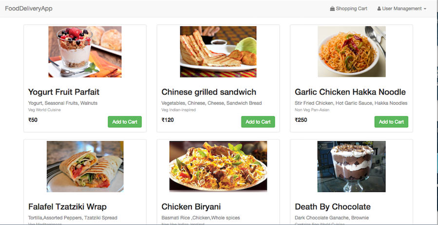
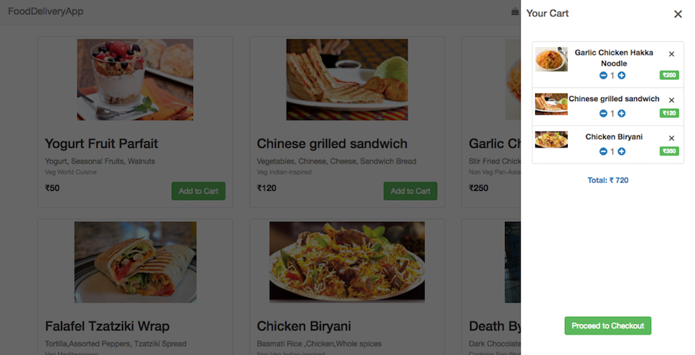
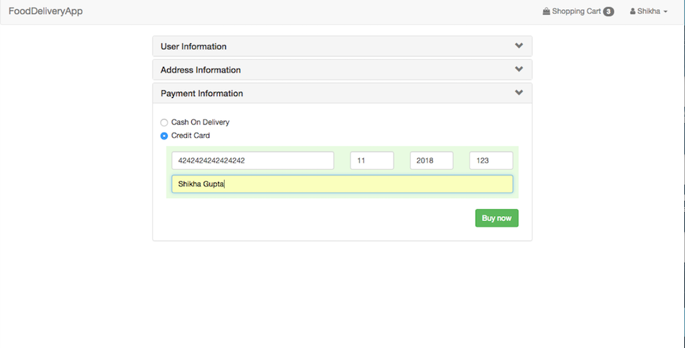
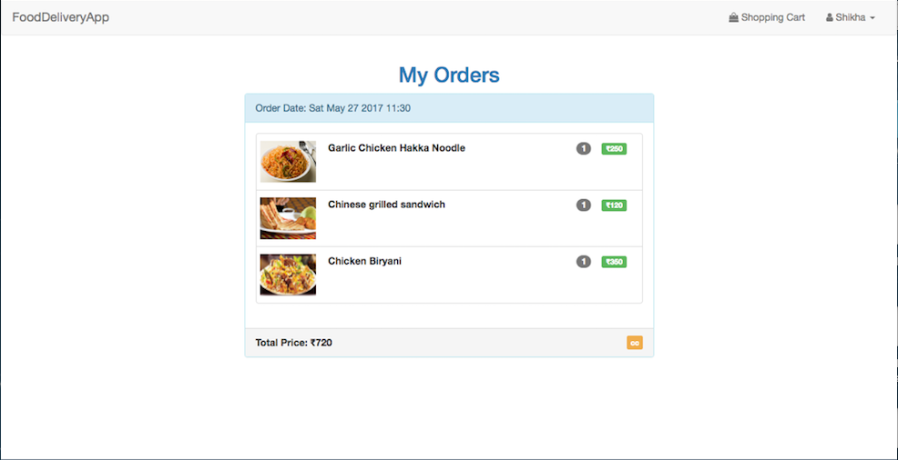

# NodeShoppingCartApp(OnDemandFood Ordering App)

OnDemand Food Delivery simulation using Node.js(Express,Mongo).
Can also be used as shopping cart app with different sets of product. 

## Prerequisites

 - MongoDB
 - Node.js


### Getting Started

The easiest way to get started is to clone the repository:

- Get the latest snapshot
```sh
git clone repo_url
```

- Change directory
```sh
cd projectname
```

- Install NPM dependencies
```sh
npm install
```

- Then start mongodb locally
```sh
mongod
```

- Then Store dummy products in mongodb
```sh
node seed/product-seed.js 
```
 

- Then simply start your app
```sh
npm start
```


## Features

- Local Authentication using Email and Password
- Flash notifications
- Bcrypt for password hash
- CSRF protection
- Payment using Stripe
- Order History

## Screenshot
- Home Page


- Cart


- Checkout


- OrderDetail


